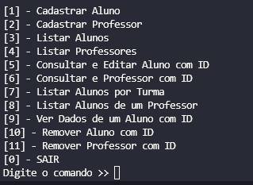

# Desafio Alura

> Neste projeto, foi utilizado o Python em sua versão __3.9.7__
##### O arquivo responsável pela "inicialização do sistema" é o "main.py"

## Abaixo, uma foto de como é a "interface" do sistema.

### Comandos:

+ Cadastrar Aluno
  - O sistema entra em modo de cadastro para aluno, onde irá perguntar as informações necessárias para realizar o cadastro.
+ Cadastrar Professor
  - Assim como o Cadastrar Aluno, o sistema irá perguntar as informações necessárias para cadastrar o Professor.
+ Listar Alunos
  - O programa irá retornar o ID(index) dos Alunos salvos no sistema, sendo que, que será necessário a utilização do ID caso o usuário precise alterar algum dado do Aluno.
+ Listar Professores
  - Assim como o Listar Alunos, retorna o ID(index) e os professores salvos no sistema.
+ Consultar e Editar Aluno com ID
  - O sistema pede o ID(index) do Aluno, retornando suas informações e perguntando se o usuário quer alterar algum dado presente no Aluno.
+ Consultar Professor com ID
  - O sistema pede o ID(index) do Professor e retorna sua informações, não é possível alterar dados.
+ Listar Alunos por Turma
  - O sistema irá pedir um código de turma, e irá retornar os Alunos que estão presentes nela.
+ Listar Alunos de um Professor
  - O sistema irá pedir um código de turma, passará pelas turmas que o Professor possui e retornará seus alunos.
+ Ver Dados de um Aluno com ID
  - O sistema pede o ID(index) de um aluno e retorna informações rápidas e simples do Aluno (Se está ativo e em que turno se encontra).
+ SAIR
  - Encerra o funcionamento do sistema.
